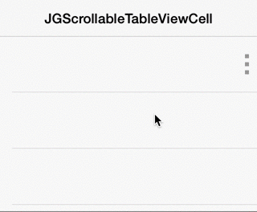

JGScrollableTableViewCell
=========================

A simple UITableViewCell subclass with a scrollable content view, exposing an accessory view when scrolled. Inspired by the iOS 7 mail app.

#Documentation coming soon!
In the meantime, check the documentation in the header files as well as the Example project.
